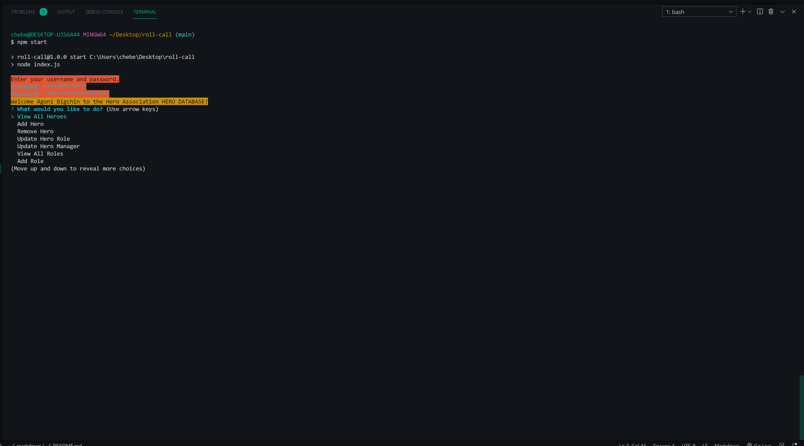
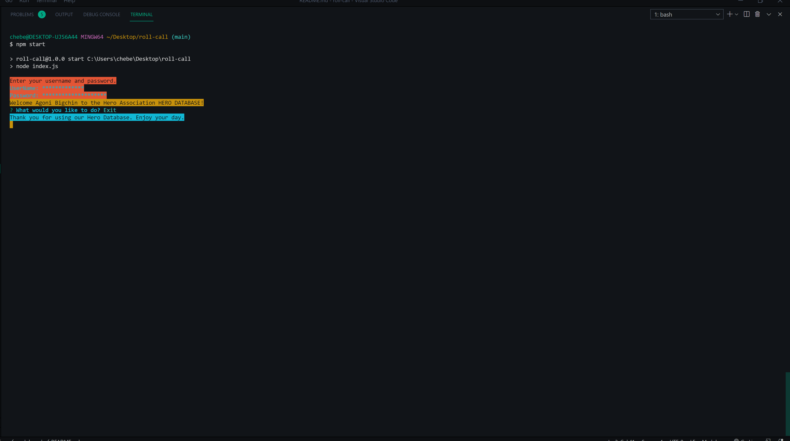

# Hero_Database

## Description

Hero Database helps you keep track of the heroes in your employ and allows you to edit them for promotions and pay raises, it also lets you remove them from your employ.

## Table of Contents

- [Installation](#installation)
- [Contributing](#contributing)
- [Tests](#test)
- [Links](#links)
- [Questions](#questions)
- [License](#license)
- [Author](#author)

## Installation

for this project you need to make sure you run an npm install with the package.json file you receive, if no package file you need to install inquirer, mysql2, chalk and console.table.

## Contributing

Cody Hebert was the only contributor to this. if anyone else wants to contribute feel free to do so.

## Tests

there is no tests for this project

## Links
- Walkthrough video: https://www.youtube.com/watch?v=Z3O1ad-_Jw4
- GitHub: https://github.com/CdHebert/roll-call

## Questions

If you have any questions feel free to either email me the question:

- My email: chebert222@gmail.com

## License

## Author

Cody Hebert.

